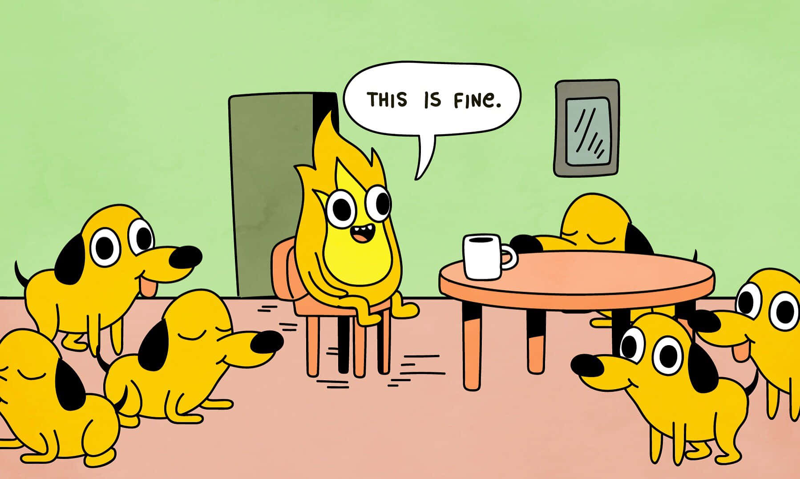

[](https://classroom.github.com/a/HYSyYzu8)

# PicPass - Image-Based Password Manager and DALL-E Image Generator

## App Platform
This app is designed for the **Command Line Interface (CLI)** and can be run on **Linux, macOS, and Windows** systems where Python is supported.

## Tech Stack
- **Python**: Programming language for the app's logic and functionality
- **Pillow**: For image manipulation and steganography
- **Cryptography**: For secure password encryption and decryption
- **Typer**: For building an interactive CLI
- **OpenAI API**: For generating images based on text prompts using DALL-E 3
- **Requests**: For making API calls and downloading images

## App Intro
**PicPass** - A versatile CLI tool for securely encrypting and storing data within images and generating new images based on text prompts with DALL-E 3.

## Tool Intro
Tools used:
- [Pillow](https://python-pillow.org/): for image handling and manipulation
- [Cryptography](https://cryptography.io/): for encryption and decryption of data
- [Typer](https://typer.tiangolo.com/): for building a user-friendly CLI
- [OpenAI API](https://openai.com/api/): for generating images with DALL-E 3
- [Requests](https://docs.python-requests.org/): for API communication and image downloads

---

## App Overview

**PicPass** is a Command Line Interface (CLI) application that offers a unique way to:
1. **Encrypt and hide passwords or text files within images** using steganography. This provides a secure, visual way to store data without it being easily accessible.
2. **Retrieve encrypted passwords or file content** from images, decrypting them for easy access.
3. **Generate images** based on text prompts using OpenAI’s DALL-E 3 model, allowing for creative image generation directly from the CLI.

### Key Features

- **Data Security**: Encrypts sensitive data and hides it within images, providing a unique layer of security and privacy.
- **AI-Powered Image Generation**: Generates images based on user prompts using DALL-E 3, allowing users to create visuals based on simple descriptions.
- **Flexible Retrieval Options**: Allows retrieval of data to the terminal or saves it as a file if it's lengthy.

### Value

PicPass offers a creative solution to securely store data within images and retrieve it when needed. By using DALL-E 3’s powerful AI, it adds a fun, creative component that enhances the overall user experience. This makes PicPass both a utility and a tool for exploration in AI-based image generation. It solves the problem of securely storing sensitive data in a visually appealing way while also providing a fun and interactive feature for generating images.

### Development Process

1. **Encryption & Steganography**: Developed functions to encrypt text data and embed it in images at the pixel level.
2. **Retrieval Functionality**: Added functionality to decrypt and retrieve data from images, displaying it or saving to a file.
3. **DALL-E 3 Integration**: Integrated OpenAI’s DALL-E 3 API for image generation, allowing users to generate images based on descriptive prompts.
4. **User Experience**: Used Typer to create a friendly CLI, with clear commands, options, and feedback for ease of use.

### Installation

1. Clone the repository from the provided GitHub Classroom link.
2. Install dependencies:
   ```bash
   pip install openai requests pillow cryptography typer
    ```


## Command Guide

Run `python main.py --help` for all available commands.

### 1. Generate Encryption Key
Generate a new encryption key and save it securely.

```bash
python main.py generate-encryption-key
```

### 2. Save Password
Encrypt and hide a password or text file content within an image.

```bash
python main.py save-password <IMAGE_PATH> <PASSWORD_OR_FILEPATH> --output-path <OUTPUT_PATH>
```
- <IMAGE_PATH>: Path to the image for encoding data. 

- <PASSWORD_OR_FILEPATH>: Password text or path to a .txt file with content to hide.

- --output-path: Optional path to save the encoded image. Default is encoded_image.png.

Example:

```bash
python main.py save-password sample.jpg "my_secret_password" --output-path hidden_password.png
```

### 3. Retrieve Password
Retrieve and decrypt a password or file content from an image.

```bash
python main.py retrieve-password <IMAGE_PATH> --output-file <OUTPUT_FILE>
```
- <IMAGE_PATH>: Path to the image containing hidden data.

- --output-file: Optional path to save the retrieved data if lengthy.


Example:

```bash
python main.py retrieve-password hidden_password.png --output-file retrieved_data.txt
```

Note: You can run the above commands to test the encryption and decryption functionality without the need for the OpenAI API key.

### 4. Generate Image with DALL-E 3
Generate an image based on a text prompt.

```bash
python main.py generate-image <PROMPT> --size <SIZE> --quality <QUALITY> --output-path <OUTPUT_PATH>
```
- <prompt_> : Description of the image.

- --size: Image size, like "1024x1024" (default).

- --quality: Quality level, "standard" or "hd".

- --output-path: File path to save the generated image.

Note: To use this command, you need to set the OPENAI_API_KEY environment variable with your OpenAI API key in main.py. You can get the API key from the OpenAI website.

Example:

```bash
python main.py generate-image "A forest landscape at sunset"
```
# Original Vs Encoded Image

<div align="center">

  <figure style="display: inline-block; text-align: center; margin-right: 20px;">
    

  </figure>

  <figure style="display: inline-block; text-align: center; margin-left: 20px;">
    

  </figure>

</div>

# Video Demo

Note: The video demo is available in the repository as well as on Google Drive. There was an issue with the video leading to oversaturation or problems in the video . Hopefully documentation and the video will help you understand the project.

[[Watch the video]](https://drive.google.com/file/d/1eTJ2NZkvFKfwqAyYugMLDmuDf6Zj6wdm/view?usp=sharing)

## Command Used in the Video

```bash
python main.py --help
python main.py generate-encryption-key
python main.py save-password images/test2.jpeg password.txt --output-path images/new_encoded.png
python main.py retrieve-password images/new_encoded.png --output-file output.txt
python main.py generate-image "$Prompt"
```